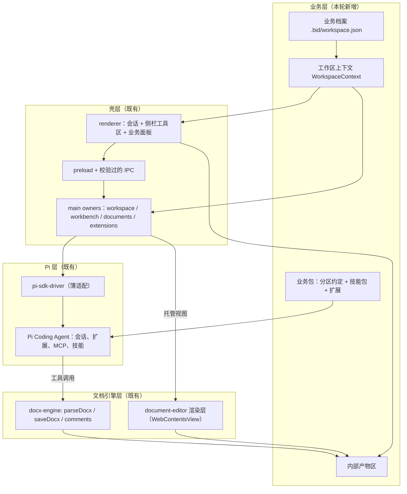
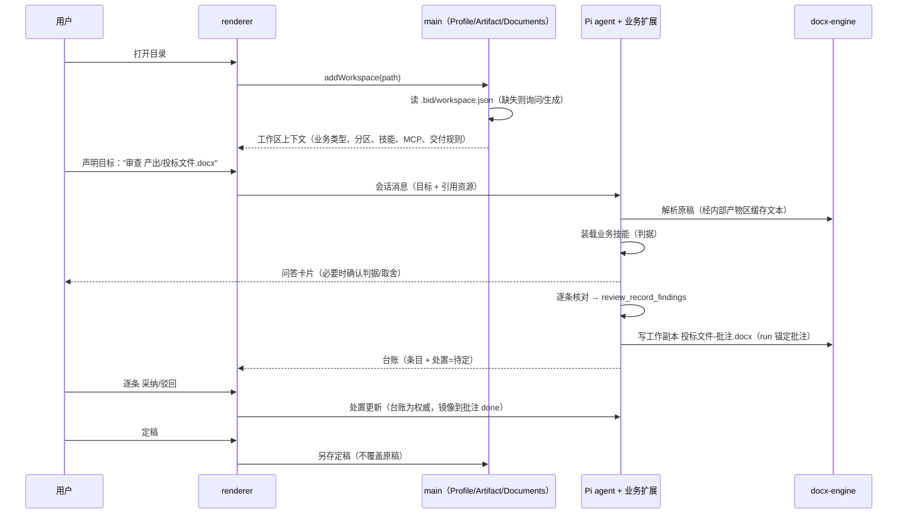

# 业务化工作区设计（Bid Workshop）

状态：**设计草案，待评审**（2026-10-08）。本文不宣称任何能力已实现；所有"已有"的判断都附代码或文档证据（附录 B）。

本文的输入是用户 2026-10-08 的一次口述（逐字稿见附录 A）。用户明确要求：先讲清"我们自己已经有了什么"，再界定名词，然后才做详细设计。因此本文的顺序是 **现状 → 术语 → 需求 → 设计 → 分期**，而不是从架构图开始。

## 0. 本轮的三个决策

动笔前确认的岔路口，已定：

| #   | 决策点         | 结论                                                                                                                                                          |
| --- | -------------- | ------------------------------------------------------------------------------------------------------------------------------------------------------------- |
| D1  | 业务层代码底座 | **借概念、壳内自建**。复用 `@genoffice/workspace-harness` 的四区语义、只读强制思路与审查台账字段设计；不引入它的 `WorkspaceStore`/工具运行时（理由见 §4.4）。 |
| D2  | 业务配置落点   | **工作区目录内**（`<工作区>/.bid/workspace.json`），随目录拷贝/入库/交接不丢；与既有 `.pi/settings.json`、`.pi/mcp.json`、`.agents/skills/` 惯例一致。        |
| D3  | 批注落盘策略   | **默认出新文件，可选原地**。默认产出 `<原名>-批注.docx`，原稿不动；提供"原地写回"选项，写前自动备份 + 二次确认。                                              |

## 1. 现状：我们已经有什么

### 1.1 四层现状

| 层             | 是什么                                                                                                                   | 现状                                                                 |
| -------------- | ------------------------------------------------------------------------------------------------------------------------ | -------------------------------------------------------------------- |
| 壳（shell）    | fork 自 pi-gui 的 Electron 桌面应用：会话优先的主面板 + 侧工作区工具 tab（Files / Review / Terminal / 扩展视图）         | 可用，有完整的 owner 边界与守卫                                      |
| Agent 运行时   | 上游 Pi Coding Agent（当前 1.0.0），经 `packages/pi-sdk-driver` 薄适配；会话正文归 Pi 所有                               | 可用                                                                 |
| 工作区（壳义） | 一个绝对路径目录 + 一条 catalog 记录；`workspaceId` 默认等于规范化路径                                                   | 可用，但**没有任何业务含义**                                         |
| 文档能力       | vendored `@genoffice/docx-engine` + 整套 genoffice 编辑器渲染层（`packages/document-editor`），以 `WebContentsView` 托管 | **只读预览可用，保存未接**（见 §1.3）                                |
| 业务逻辑       | `extensions/bid-review`：读 docx → 模型审 → 写回 Word 批注                                                               | 代码齐，**从未用真实模型端到端跑通**（`docs/目标与计划.md` §8.1 M4） |

### 1.2 已经能用的事实（这部分是资产，不要重做）

**工作区与目录**

- workspace 在数据上就是 `WorkspaceCatalogEntry { workspaceId, path, displayName, lastOpenedAt, sortOrder }`（`packages/catalogs/src/types.ts:5-12`）；运行时引用 `WorkspaceRef { workspaceId, path }`（`packages/session-driver/src/types.ts:13-17`）。
- 打开目录：侧边栏 "Open folder" → 原生选目录 → `addWorkspace(path)` → `driver.syncWorkspace(path)`（realpath 规范化 → 写 catalog → 扫 Pi 会话目录）。入口在 `apps/desktop/src/features/threads/sidebar.tsx:483-495`，owner 在 `apps/desktop/electron/workspace/app-store-workspace.ts:125-198`。
- catalog 持久化：默认 `~/.pi-gui/catalogs.json`（`packages/catalogs/src/node/json-catalog-store.ts`），桌面实际用 `userData/catalogs.json`（`apps/desktop/electron/application/app-store.ts:289`）。catalog 只存元数据，不存会话正文。
- 工作区目录内的既有约定文件：`.pi/settings.json`（项目级 Pi 设置，含 `extensions` 数组；样例见 `workspaces/bid-sample/.pi/settings.json`）、`.pi/mcp.json`（项目级 MCP）、`.agents/skills/<name>/SKILL.md`（项目级技能）。

**能力接入（关键：这一块比想象中完整）**

- **MCP 已经能用**：宿主负责读写两个 `mcp.json`（全局 `~/.pi/agent/mcp.json` + 项目 `<工作区>/.pi/mcp.json`），连接由 Pi 内置 `mcp` add-on 完成；设置页在 Settings → "MCP servers"（`packages/pi-sdk-driver/src/mcp-config.ts:63-67`、`packages/pi-sdk-driver/src/pi-addon-extensions.ts:18-38`、`apps/desktop/src/features/settings/settings-mcp-section.tsx`）。**项目级 MCP 天然就是"绑到某个工作区"**，与用户的设想一致。
- **技能已经能用**：`SKILL.md` + YAML frontmatter（`name` / `description` / `disable-model-invocation`），按 scope 分为 Workspace（项目级，落在 `<工作区>/.agents/skills/`）、User、This session；会话内以 `/skill:<name>` 调用；Settings → "Skills and extensions" 可查看、启停、"Try"（`packages/session-driver/src/runtime-types.ts:38-48`、`packages/pi-sdk-driver/src/runtime-supervisor.ts:873-911,1159-1195`、`apps/desktop/src/features/extensions/skills-view.tsx`）。
- **扩展已经能用**：文件式 Pi 扩展（`index.ts` 导出 `(pi) => void`），可注册工具/命令/桌面视图。桌面视图经 `registerDesktopView(pi, { id, title, source, frontend, backend })`（`packages/extension-ui/src/index.ts:7-75`），宿主按"视图 / 任务 / 运行时世代"各起一个 backend facet host，前端跑在 `sandbox="allow-scripts"` 的不透明源 iframe 里，走 `pi-extension://<connection>/` 提供本地资源，**每连接 CSP 拒绝网络、worker、嵌套 frame**（`apps/desktop/electron/extensions/extension-view-owner.ts:107`）。

**文档能力**

- `parseDocx(bytes) → ParsedDocFull`（`vendor/genoffice/docx-engine/src/parse.ts`）、`saveDocx(parsed, blocks, options)`（`vendor/genoffice/docx-engine/src/patch.ts:348`）。`SaveBlock` 三态：`original`（逐字节复制）/ `generated`（重生成段落）/ `xml`（原样插入）。
- 批注**读**：`ParsedDoc.comments: CommentInfo[]`，含 `id / author / date / text / parentId / done / paraId`（`vendor/genoffice/docx-engine/src/types.ts:253,2153`）。
- 批注**写**：`SaveOptions.comments?: CommentInfo[]`，语义是**全量重写** `word/comments.xml`；锚点挂在 run 上（`run.commentIds`），生成 `commentRangeStart/End` + `commentReference`（`vendor/genoffice/docx-engine/src/patch.ts:199`）。
- 编辑器渲染层：`packages/document-editor`（genoffice AI Docs 前端整份拷入，构建为静态 bundle），由主进程 `DocumentViewOwner` 以每窗口一个 `WebContentsView` 托管，经一次性 token（`bid-docs://app/_handoff/<token>`）交接，字节不过 IPC（`apps/desktop/electron/documents/document-view.ts:73`）。Files 里点 `.docx` 走这条路，**渲染真实正文**（有 core spec 断言）。
- 业务扩展已有雏形：`extensions/bid-review` 注册 5 个工具（`bid_load_document` / `bid_start_review` / `bid_record_findings` / `bid_write_comments` / `bid_export_report`）、1 个命令、2 个桌面视图（"Bid Review" 条目面板 + "Bid Document" 逐块文档视图，把条目按 `blockIndex` 贴成批注卡）。判据来自同目录 `评审条件.md`，代码内置 `DEFAULT_CRITERIA` 兜底（`extensions/bid-review/review.ts:7,10,98`）。批注写回产出 `…-批注.docx`，**不原地改原稿**（`extensions/bid-review/parser-docx.mjs:77`）。
- 待审样例与判据样例齐备：`workspaces/bid-sample/`（`投标文件-某软件科技.docx` 74 块/3 表/17 标题，5 章，故意埋了缺项、报价合计不符、工期超限、签章留空；`评审条件.md` 四类 17 条）。

**已有可复用的"向用户呈现"通道**：transcript 扩展卡片（`pi.appendEntry("pi-gui.card", …)`）、钉在 composer 上方的 pin（最多 3 个）、回合改动卡、工具输出图片、`ctx.ui.notify` 通知。

### 1.3 关键缺口（这是本轮要补的）

| #   | 缺口                                                                                                                  | 证据                                                                                                                                      | 影响                                                                                   |
| --- | --------------------------------------------------------------------------------------------------------------------- | ----------------------------------------------------------------------------------------------------------------------------------------- | -------------------------------------------------------------------------------------- |
| G1  | **编辑器保存未接**：宿主把 `saveDocx*` 全桩成 `{ok:false}`                                                            | `apps/desktop/electron/document-preload.ts:49-56`；`DocumentViewOwner` 无保存路径                                                         | "在文档里插入新数据"目前只能走无头 `saveDocx` 出新文件，不能落到用户眼前那个打开的文档 |
| G2  | **表格内段落无法锚定批注**：只有 `paragraph`/`heading`/`listItem` 可重生成，表格段落计为 `skipped`                    | `extensions/bid-review/parser-docx.mjs:13`                                                                                                | 报价明细表这类**最要命的位置**出不了批注                                               |
| G3  | **批注读取没接进审查链**：引擎能读 `ParsedDoc.comments`，但 `BidParsedDocument` 只声明 blocks                         | `extensions/bid-review/document.ts:27`                                                                                                    | 第二轮审查看不到上一轮提了什么，无法做"仍存在/已修复"的迭代判断                        |
| G4  | **无逐条采纳/驳回闭环**：条目只有内存 Map + 扩展 state，没有处置状态，也没有更新入口                                  | `extensions/bid-review/contract.ts:32`、`extensions/bid-review/index.ts:34`                                                               | 用户"选择是否接纳每一条"这件事无处落账，迭代无从谈起                                   |
| G5  | **无结构化问答**：全仓库没有 `ui_ask`/`form`/`elicit` 类能力；只有 TUI 风格的 `ctx.ui` 对话框与扩展卡片               | `vendor/genoffice/workspace-harness` 全树无此工具；`vendor/genoffice/workspace-harness/src/tool/types.ts:64` 的 `confirm` 是 UI-only 通道 | 用户说的"需要用户输入或用户选择，有可能有一些 form"没有载体                            |
| G6  | **无"对用户不可见的中间产物"概念**：全仓库无 `hideTool/toolVisibility` 之类状态；中间结果只能塞进 transcript 或工作区 | grep 零命中                                                                                                                               | 抽取出的 docx 文本、解析缓存会污染工作区或对话                                         |
| G7  | **工作区没有业务含义**：workspace 只是一条路径记录                                                                    | §1.2                                                                                                                                      | 打开目录后软件不知道这是"投标"，也不知道哪些只读、哪些可写、该走什么流程               |

另有两处**与既有文档不一致**，写新设计时不要按旧文档行事：

- `docs/plan.md` 的"当前状态"表说"Word 批注输出 ❌ 未做"——**已实现**（`bid_write_comments` + `parser-docx.mjs`）；同表说 docx-engine"零引用"——**已引用**。
- `README.md:35` 与 `AGENTS.md` 提到根级 `skills/` 目录、`docs/` 引用 `.agents/skills/verify-pi-gui/SKILL.md`——**当前 checkout 里都不存在**。不要把"已有 skills 目录"当既成事实。
- `workspaces/*/.pi/settings.json` 里的扩展路径是**环境相关的绝对路径**，指向另一个 checkout 而不是本仓库相对路径——换机器或重新 clone 之后必须改，否则扩展加载不上。

## 2. 术语表：先界定，再设计

用户要求"这些名词应该有明确的界定"。下面每条给 **定义 / 不是什么 / 实现位置**。

### 2.1 核心名词

**工作区（WorkSpace，业务义）**
一个磁盘目录 + 一条 catalog 记录，**并且**（可选）携带一份业务档案（`.bid/workspace.json`）。它承载"一次投标"或"一批同类文档处理"的全部文件、能力绑定与流程定义。
_不是_：不是一个数据库记录、不是一个云端租户。目录即工作区，拷贝目录即拷贝工作区。
实现位置：`packages/catalogs/src/types.ts`、`apps/desktop/electron/workspace/app-store-workspace.ts`。

**侧工作区（Side Workspace，壳义）** —— **必须消歧**
pi-gui 里 "workspace" 也指主面板右侧那个工具 tab 区（`aria-label="Side workspace"`，`apps/desktop/src/features/workbench/workbench.tsx`）。本设计中文一律称**侧栏工具区**，绝不与业务工作区混称。

**分区（Zone）与四区模型**
按用途给工作区目录划分的语义区。四种 kind：

- `reference`（只读引用）：共享的公司资料库，源即权威，工作区只挂引用；
- `material`（只读资料）：本次项目专属的只读输入，如发标方的招标/磋商文件；
- `output`（可写产出）：我们要写的标书、报价表、定稿；
- `feedback`（可写意见）：审查意见、报告、台账导出物。

_不是什么_：分区**不是**固定目录名，**不是**必须存在。它是一份**声明式映射**（zone kind → 相对路径列表），可以零分区（全部平铺在一个目录下），也可以一个 kind 对多个目录。这与用户"有可能分门别类使用不同目录，有可能全都放同一个目录"的要求一致。
参考实现（语义与常量命名，非代码复用）：`vendor/genoffice/workspace-harness/src/workspace/zones.ts`（`ZONE_DIRS = {引用,资料,产出,意见}`、`READ_ONLY_ZONES`、`isReadOnlyPath()`、`assertWritable()`）。

**业务档案（Business Profile）**
工作区目录里的 `.bid/workspace.json`：声明业务类型、分区映射、技能清单、能力绑定、交付规则。**它决定软件打开这个目录之后的行为**。
_不是什么_：不是应用侧设置，不是用户偏好；它是跟着目录走的东西。

**业务包（Business Pack）**
某个业务（如 `bid-tender`）的完整能力集合 = 分区约定 + 技能包 + 扩展（工具与视图）+ 判据 + 默认交付规则。实现上它是"一个扩展 + 一组 SKILL.md + 一份 JSON schema"的组合，不是一个新运行时。

**技能（Skill）**
带 YAML frontmatter 的 `SKILL.md` 文件，用自然语言描述**怎么做一件事**——在本设计里它就是**业务 SOP 与判据的载体**（"磋商文件里哪些要求必须逐条对上号""报价合计必须与分项一致""工期不得超过 180 日历天"）。
_不是_：不是代码插件（那是扩展），不是提示词片段库（那是 prompt 模板）。
实现位置：`packages/pi-sdk-driver/src/runtime-supervisor.ts:873-911,1159-1195`、`apps/desktop/src/features/extensions/skills-view.tsx`。

**扩展（Extension）与扩展视图（Extension View）**
扩展 = 文件式 Pi 扩展，提供工具/命令；扩展视图 = 扩展注册的浏览器界面，挂在侧栏工具区的一个 tab 里，跑在受限 iframe 中。
_不是_：扩展视图**装不了**需要 worker / 网络 / 自有 preload 的编辑器（每连接 CSP 拒绝这些）；这条已在 `docs/目标与计划.md` §11 排除，不要再提。

**任务（Task）/ 会话（Session，UI 叫 Thread）/ 轮次（Turn）**
沿用 `docs/workspace-redesign-plan.md:84-86` 的定义：任务身份 = `SessionRef`(workspaceId, sessionId)；会话正文归 Pi 所有；轮次是"一个用户可见的执行区间"。
**不要**从"全局选中的任务"推断操作目标——这是既有硬约束。

**能力绑定（Capability Binding）**
工作区声明可用的外部访问/操作能力 = **MCP 服务**（公司知识库、合同系统、报价系统……）与**本地数据**（分区里的文件）。
_不是什么_：不是权限系统。"绑定"只回答"能连什么"，不回答"谁允许谁"。

**目标（Goal）与审查运行（Review Run）**
目标 = 一次业务意图的显式声明（如"审查产出/投标文件.docx，按 review 判据出批注"）。一轮目标驱动的执行 = 一个 Run。Run 有输入（文档 + 判据 + 技能）、产物（条目 + 批注 + 报告）、可追溯记录。

**审查条目（Finding）/ 台账（Ledger）/ 处置（Disposition）**
条目 = 结构化结论：`severity`（严重度）/ `check`（判据项）/ `basis`（依据）/ `location`（位置）/ `quote`（引文）/ `verdict`（结论）/ `problem` / `advice` / `disposition`（处置：待定/采纳/驳回）。
台账 = 条目的**权威存储**（含处置状态与 run 历史）。处置 = 用户对单条的选择。
参考字段设计（**这是本设计要借鉴的重点**）：`vendor/genoffice/workspace-harness/src/tools/review.ts:26-53`（`REVIEW_SEVERITIES` = 废标/重大偏离/扣分/瑕疵；`REVIEW_VERDICTS` = 满足/部分满足/不满足/无法核对；`REVIEW_DISPOSITIONS` = 待定/采纳/拒绝）。注意：那个包里 `disposition` 字段存在但**没有任何工具去改它**——闭环正是缺口 G4。

**批注（Word Comment）**
条目在 Word 文档里的**呈现形态**（anchored comment + 可选回复 + 已解决标记）。
_不是什么_：不是权威状态。权威状态在台账；批注是交付形态与工作副本上的一层意见。

**内部产物（Internal Artifact）/ 可见产物（Visible Artifact）**
内部产物 = 由软件体系管理、用户可以完全不知道其存在的中间结果（docx 抽出的文本、解析缓存、模型中间输出、渲染用的临时 HTML）。存放位置**在工作区之外**（应用自有区域，见 §8）。
可见产物 = 落在工作区分区里的文件（报告、定稿、意见导出）。
_不是什么_：内部产物不进 Files 面板、不进 git、不进工作区目录。

**审查（Bid Review）vs Review（壳的 Git 比较）** —— **必须消歧**

- 业务义：AI 按判据审标书，出条目、写批注。本文称**审查**。
- 壳义：`Review is a comparison, not a panel mode`（`docs/workspace-redesign-plan.md:128`），scope = `uncommitted | branch | turn`，是 Git 变更比较。本文称**变更比较**，UI 现有的 "Review" 工具 tab 建议中文显示为"变更"。
- 中文文档里"审阅"目前被用来兼指"Word 批注/人参与"和"AI 审查"，**本文不再使用"审阅"一词**，一律用"审查"（AI 出结论）与"批注/采纳"（人参与）。

### 2.2 本设计新引入的名词

| 名词                                | 定义                                                                                                                                        |
| ----------------------------------- | ------------------------------------------------------------------------------------------------------------------------------------------- |
| 业务档案                            | 见上，`<工作区>/.bid/workspace.json`                                                                                                        |
| 工作区上下文（Workspace Context）   | 打开工作区后，软件从业务档案推导出的运行时状态：业务类型、分区只读映射、可用技能与扩展、绑定的 MCP、默认交付规则。renderer 只读它，不推导它 |
| 问答卡片（Ask Card）                | 结构化向用户提问并**回收答案**的载体（单选/多选/自由文本/确认）。当前不存在（缺口 G5），本设计新增                                          |
| 审查工作副本（Review Working Copy） | 默认产出物 `<原名>-批注.docx`；原稿不动                                                                                                     |
| 定稿（Final）                       | 用户处置完成后另存/覆盖的交付文件                                                                                                           |
| 内部产物区（Artifact Store）        | 应用自有、按工作区隔离、不进工作区目录的内部产物落点（§8.2）                                                                                |

## 3. 需求：从用户故事到设计约束

把口述拆成可验收的用户故事，并给出必然的约束。

| #   | 用户故事                                                                               | 设计约束                                                                                             |
| --- | -------------------------------------------------------------------------------------- | ---------------------------------------------------------------------------------------------------- |
| U1  | 用户打开一个已经放好文件的目录，软件就知道这是"投标"这件事                             | 业务档案必须在目录内（D2）；打开流程要"识别 + 兜底询问"，不能因为缺档案就打不开                      |
| U2  | 目录里有的东西是只读的（公司情况、人员情况、发标方要求），有的是我们要写的（标书产出） | 分区声明 + **工具层强制只读**；未声明分区时不能默默把所有东西当可写                                  |
| U3  | （可选）用户可以让软件把目录整理成更好用的结构；也可以自己先按规格整理好，跳过这一步   | 整理必须是**可跳过**的独立过程，且只做"移动到分区 + 登记"，不改文件内容                              |
| U4  | 用户提出一个目标（例如"审查这份标书"），用聊天的方式驱动                               | 目标是显式声明的一等输入；执行仍走 Pi 会话（不新建调度器/循环）                                      |
| U5  | 审查要覆盖哪些判断，靠业务技能描述，别漏                                               | 判据以 SKILL.md 为载体；一次 run 必须能回答"这次用了哪些技能/判据/版本"                              |
| U6  | 过程中软件可能需要用户输入或选择（form）                                               | 新增结构化问答通道（问答卡片），答案要能进模型上下文并落账                                           |
| U7  | 结论要给到用户，且与文档位置绑定："这里改成什么样"                                     | 条目模型带 `location + quote`；写出 Word 批注到工作副本；表格内位置的限制必须显式告知（G2）          |
| U8  | 用户逐条决定采纳/驳回，然后迭代                                                        | 台账 + 处置为权威；批注状态为镜像；第二轮要能识别"仍存在/已修复"（需要读回上一轮批注，G3）           |
| U9  | 最后生成新的文档                                                                       | 定稿动作与工作副本分离；默认不覆盖原稿（D3）                                                         |
| U10 | 读文档、往文档里插数据、插批注——这些都得支持                                           | 写能力必须补：至少无头 `saveDocx` 路径（已有先例）；编辑器原地保存在范围内与否要显式表态（§10、§11） |
| U11 | 有些东西不该让用户看见（转出来的文本、临时文件）                                       | 内部产物区（§8），与工作区分开管理                                                                   |
| U12 | 内嵌 office 里的 genspark 聊天窗与工具栏要能隐藏                                       | 文档视图需要对外开关；现状宿主侧是 noop（§9.4）                                                      |
| U13 | 聊天时能把工作区里的资料引进来一起判断                                                 | 工作区上下文要能构成"可引用资源集"，并像附件/引用一样进上下文                                        |

**非目标（本轮明确不做）**

- 业务角色与权限（管理员、审核员）——`docs/目标与计划.md:175` 已排除，本设计不引入。
- 第二个安装器/市场/清单扫描器——沿用 Pi 的发现与信任。
- 替换 Pi 的会话所有权，或引入第二个会话数据库。
- 新的调度器或自定义 agent 循环。
- 复用上游编译产物、为对齐上游升级 Electron（`docs/目标与计划.md` §11 已排除的路）。

## 4. 总体架构

### 4.1 分层



要点：

- **业务档案是唯一事实源**，工作区上下文由 main 侧 owner 推导，renderer 不自己猜。
- **业务能力仍然由 Pi 提供**（扩展的工具/命令、SKILL.md、`.pi/mcp.json`）。本设计**不新增运行时**，只新增"业务解释层 + 若干个面 + 一条闭环"。
- **写文档必须有两条路**：agent 侧（无头 `saveDocx`，产出新文件）与用户侧（编辑器保存，原地）。两者都要，缺前者做不了批量/自动，缺后者做不了"我看着改"。

### 4.2 新增/改动的 owner

| Owner                        | 位置（建议）                                                       | 拥有什么                                                     | 明确不拥有                           |
| ---------------------------- | ------------------------------------------------------------------ | ------------------------------------------------------------ | ------------------------------------ |
| WorkspaceProfileOwner        | `apps/desktop/electron/workspace/workspace-profile.ts`             | 读/校验/写 `.bid/workspace.json`；推导工作区上下文；只读映射 | 不碰 Pi 会话、不碰文件内容           |
| ArtifactStoreOwner           | `apps/desktop/electron/artifacts/artifact-store.ts`                | 内部产物区的路径、写入、清理、按工作区隔离                   | 不参与渲染，不暴露给 renderer 列目录 |
| AskOwner                     | `apps/desktop/electron/conversation/ask.ts` + 契约                 | 问答卡片的生命周期、答案回收、超时/取消                      | 不解释答案语义（那是扩展/技能的事）  |
| business-pack 扩展（业务包） | `extensions/bid-review/`（演进，或新建 `extensions/bid-tender/`）  | 工具（读/写/批注/台账）、判据装载、审批视图                  | 不拥有工作区生命周期，不拥有会话     |
| 文档写入路径                 | `apps/desktop/electron/documents/` + 提取 `packages/` 里的无头写入 | 工作副本生成、原地写回（备份）、保存                         | 不做业务判断                         |

边界纪律（沿用既有守卫，不得放宽）：renderer 只依赖 `apps/desktop/contracts/*` 与 preload；portable 包不得 import desktop 实现；`scripts/check-{renderer,host,contract}-boundary*.mjs`、state-owner 守卫、IPC 主帧守卫全部保持。**要用窄接口，不要去扩 allowlist。**

### 4.3 一条完整链路的时序（首次审查）



### 4.4 为什么不直接复用 workspace-harness 的运行时（D1 的理由）

它是现成的、且几乎是照标书审查写的（四区、只读强制、审查台账、无头读文档、git 版本、样例空间生成器）。不复用运行时的理由有四条硬证据：

1. **它的 agent 层实际不可 import**：包 pin `@earendil-works/pi-agent-core@0.87.1` / `pi-ai@0.87.1`，本仓库已是 1.0.0；本仓库 vendored 副本的 export map 里**没有 `./agent/*`**，`AgentHost`/`effect-dispatch` 那 5 个文件拿不到（`vendor/genoffice/workspace-harness/package.json:8-13`）。而它的工具层**依赖** `ToolContext` 注入的四组 bridge（`UiBridge`/`ShellBridge`/`DocumentEditBridge`/`VersionBridge`），desktop 侧一套都没有。
2. **目录名与只读集合写死**：`引用/资料/产出/意见` 是常量，不可配置（`zones.ts:16-31`）；台账固定写 `产出/审批数据.json`。与用户"分区可选、目录可不同、甚至全平铺"的要求冲突。
3. **它的 `doc_*` 是"活编辑器工具"**：要求文档已在编辑器 tab 打开，经 `docEditBridge.runCommand` 派发；而本项目现有且可用的批注路径是**无头 `parseDocx` + `saveDocx`**。强行复用等于先实现一套编辑器桥接，再放弃已有的可用路径。
4. **它不给业务 SOP 落点**：没有技能/模板体系，`systemPrompt` 是外部字符串，`skillId/skillVersion` 只是记录字段。

**借鉴清单（要抄的部分）**：`zones.ts` 的语义与命名、`assertWritable` 的"写路径硬拒绝"、审查台账的字段与枚举（severity/verdict/disposition）、`review_write_findings` 的校验思路（非"满足"必须给 problem、id 不重复）、`doc_read_blocks` 的 `#块N` 位置引用写法、`fs_list` 隐藏 `.workspace`/`.git` 的做法。

## 5. 工作区模型

### 5.1 目录布局

**声明式，全部可选。** 推荐布局（用于 `业务包 = bid-tender` 的默认生成）：

```
我的投标项目/
  .bid/workspace.json        # 业务档案（机器读，人可读可改）
  .pi/settings.json          # 既有：项目级 Pi 设置（扩展）
  .pi/mcp.json               # 既有：项目级 MCP 绑定
  .agents/skills/            # 既有：项目级技能（业务判据）
    bid-qualification/SKILL.md
    bid-pricing-consistency/SKILL.md
    公司资料/                 # zone: reference（只读，可指向共享库）
    招标文件/                 # zone: material（只读）
    产出/                     # zone: output（可写）
    意见/                     # zone: feedback（可写）
```

**平铺布局**（用户"全都放同一个目录下"）：不做任何分区声明，业务档案只写 `business` 与 `skills`。此时**没有任何目录被声明为只读**，因此：

- 只读强制只对"被显式声明为 `reference`/`material` 的目录"生效；
- 未分区时，写入类操作**必须显式给出目标路径**，且对被审文档的写入默认走工作副本（沿用 D3）；
- 侧栏工具区不显示"分区"分组，业务面板显示"未分区"提示与"整理目录"入口。

### 5.2 业务档案 schema

```jsonc
{
  "schemaVersion": 1,
  "business": "bid-tender", // 业务包 id；决定加载哪套分区/技能/交付默认值
  "name": "某软件科技-投诉系统项目投标", // 可选，覆盖目录名显示
  "goal": "按评审条件审查产出目录的投标文件，逐条出批注", // 可选，作为会话初始目标
  "zones": {
    // 可选；缺省=平铺
    "reference": ["公司资料"],
    "material": ["招标文件"],
    "output": ["产出"],
    "feedback": ["意见"],
  },
  "skills": ["bid-qualification", "bid-pricing-consistency"], // 可选；引用 .agents/skills 里的名字
  "capabilities": {
    // 可选；能力绑定
    "mcp": ["company-kb"], // 引用 .pi/mcp.json 里的 server 名
  },
  "delivery": {
    // 可选；交付默认值
    "commentTarget": "copy", // copy（默认，出新文件） | inPlace（写前备份+确认）
    "outputSuffix": "-批注",
    "criteriaFile": "评审条件.md", // 判据文件位置（沿用 bid-review 现有约定）
  },
}
```

纪律：

- **校验在入口**：读入时按版本校验，未知字段/不支持版本**拒绝**而不是丢弃（沿用既有外部数据校验惯例）；缺失可选字段用默认值补齐。
- **写入保留原件**：首次由软件生成或升级时，原子写（tmp + rename），并针对"由软件生成的档案"保留上一版 `.bak`。
- **不要**把 workspaceId、时间戳、最近状态写进档案（那些属于应用侧 catalog）。

### 5.3 打开一个目录的流程

1. 用户 "Open folder" → `addWorkspace(path)` → `syncWorkspace`（既有流程不变）。
2. main 侧 `WorkspaceProfileOwner` 读 `<path>/.bid/workspace.json`：
   - 存在且合法 → 推导工作区上下文（业务类型、分区只读映射、技能清单、MCP 绑定、交付规则）；
   - 存在但不合法 → **不阻断打开**，标记为"业务档案无效"，给出修复/重建入口与诊断；
   - 不存在 → 探测目录内容（是否含 `.docx` 待审文件、是否有 `评审条件.md` 之类判据文件），给一张"这是投标工作区吗？要不要按推荐规格初始化？"的确认卡片（可拒绝；拒绝后按普通工作区打开）。
3. renderer 拿到工作区上下文，据此设置：侧栏分组、业务面板、默认交付规则、只读提示。
4. 之后一切写入路径都查上下文：被声明为只读的分区，**工具层与主进程写入路径双重拒绝**（不是靠 UI 禁用）。

### 5.4 与既有约定文件的关系

| 文件                             | 谁拥有                                   | 关系                                                                               |
| -------------------------------- | ---------------------------------------- | ---------------------------------------------------------------------------------- |
| `.pi/settings.json`              | Pi（经 `compat/pi-project-settings.ts`） | 扩展加载；业务包不重复声明扩展                                                     |
| `.pi/mcp.json`                   | 宿主写入、Pi 内置 `mcp` 连接             | 业务档案的 `capabilities.mcp` 只做**引用与展示**，不重复存储凭据                   |
| `.agents/skills/<name>/SKILL.md` | Pi 资源发现                              | 业务判据的落点；业务档案的 `skills` 只做**启用清单**（配合既有 `setSkillEnabled`） |
| `.bid/workspace.json`            | 本设计新增的 `WorkspaceProfileOwner`     | 业务解释层                                                                         |

### 5.5 只读强制

三个层次，全部要有：

1. **工具层**：读写类工具入口先判分区，只读区拒绝（语义参考 `workspace-harness/src/workspace/zones.ts:72-88` 的 `assertWritable`）。
2. **主进程文件写入路径**：renderer 请求写文件时，owner 校验目标路径不在只读分区内。
3. **UI**：只读分区在 Files 里显示只读标记；文档视图对只读区的文档以只读打开。

## 6. 资源组织（整理过程，可选）

**定位**：可跳过的独立过程，只做"归位 + 登记"，不改内容。

动作集合（每个都幂等、可预览、可撤销或至少可报告）：

| 动作           | 说明                                                                                                         |
| -------------- | ------------------------------------------------------------------------------------------------------------ |
| 扫描与分类建议 | 列出目录里的文件，按扩展名/名字/内容摘要建议归入哪个 zone（只给建议，不自动移动）                            |
| 移动到分区     | 按确认后的建议移动；移动前生成清单，冲突（同名/已存在）显式报告                                              |
| 挂引用         | 公司资料这类共享资源可"挂引用"而非拷贝（参考 `ReferenceStore` 的 symlink 语义；是否用 symlink 待定，见 §12） |
| 复制入区       | 外部文件拷入 `material`（项目专属、可移植）                                                                  |
| 生成判据骨架   | 若目录里没有判据文件，生成 `评审条件.md` 骨架（业务包提供模板）                                              |
| 生成业务档案   | 写 `.bid/workspace.json`                                                                                     |
| 初始化版本     | 可选：为工作区建立 git 版本（有 `git` 才启用，否则静默降级为无版本）                                         |

**跳过路径**：用户已经按规格整理好 → 不跑整理，直接声明目标进入审查。软件必须能只靠"分区声明 + 判据文件"跑完审查，不依赖整理过程留下的任何中间状态。

## 7. 审查流程（主流程）

### 7.1 目标声明与 Run

- 目标由用户显式给出（自然语言 + 结构化部分：审哪个文件、用哪些判据、交付形式）。落成会话上的一条声明（`pi.appendEntry` 或扩展 state），并在业务面板里恒常可见。
- 一次 Run 的记录（台账头）至少要能回答：**审的是哪个文件（含内容指纹）、用了哪些技能与判据版本、哪个模型、什么时候、产出在哪**。参考 `workspace-harness/src/tools/review.ts` 的 `ReviewRunHeader{runId, at, document, skillId, skillVersion, model, findings}` 与指针 `ReviewPointer{latest, runId, at, document, counts}`。
- 执行仍走 Pi 会话；不新增调度器。用户可以在同一会话里继续追问、要求补充审查（这天然就是"迭代"）。

### 7.2 技能：业务 SOP 与判据

- 一个业务包带一组技能，每个技能对应一类判据（资质/报价/技术/法律/格式），内容 = 判据条目 + 检查方法 + 输出要求。
- 技能的 scope 用 **Workspace 级**（`<工作区>/.agents/skills/`），因为它绑业务、绑项目、要能跟着目录走。
- 一次 Run 必须记录使用的技能与版本（技能文件内容指纹），否则"这次的结论依据什么"不可追溯。
- 已有雏形要收敛：现在判据是 `评审条件.md`（自由 Markdown）+ 代码里 `DEFAULT_CRITERIA` 兜底。**保留 `评审条件.md` 作为客户可读的判据文件**，同时用技能描述"怎么查"；两者不重复（判据文件说"要求什么"，技能说"怎么核对、边界条件、反例"）。

### 7.3 能力绑定（MCP 与本地数据）

- 工作区可绑定 MCP（如公司知识库）：`capabilities.mcp` 引用 `.pi/mcp.json` 里的 server 名。
- 典型用法：**公司资料不落进工作区，而是通过 MCP 查询**（用户原话："将来会变成一个 MCP 的 service，通过这个 service 可以获取到公司资料"）。此时 `reference` 分区可以不存在。
- 纪律：MCP 提供的只读资料在审查中**与本地只读文件等价**（同样不可写）；MCP 的调用结果如需留痕，落内部产物区。

### 7.4 条目模型与台账

条目（`Finding`）字段沿用并补齐：

```ts
type Severity = "废标" | "重大偏离" | "扣分" | "瑕疵" | "提示";
type Verdict = "满足" | "部分满足" | "不满足" | "无法核对";
type Disposition = "待定" | "采纳" | "驳回";

interface Finding {
  id: string; // run 内唯一；跨 run 用 fingerprint 追踪
  fingerprint: string; // check + location + quote 的稳定摘要（跨 run 去重/追踪）
  severity: Severity;
  check: string; // 判据项（如 A3 或 磋商文件 3.2）
  basis: string; // 依据（判据原文/出处）
  location: { file: string; blockIndex?: number; quote?: string; page?: number };
  verdict: Verdict;
  problem?: string; // 非"满足"必填
  advice?: string;
  disposition: Disposition;
  disposedBy?: string;
  disposedAt?: string;
  dispositionNote?: string;
}
```

台账（`Ledger`）：

- **权威存储**：会话内扩展 state（Pi session entries 是既有持久所有者）+ 可选导出到 `feedback/` 分区（jsonl + 指针）。
- **跨 run 累积**：新一轮 run 不覆盖旧条目，而是产出新的 run 记录，并给出与上一轮的差异（新增 / 仍存在 / 未再出现 / 已处置后仍存在）。
- 校验沿用 `workspace-harness/src/tools/review.ts:107-134` 的思路：必填非空、枚举合法、id 不重复、非"满足"必须给 `problem`。

### 7.5 批注写回

现状能力与限制（决定设计）：

- 写：`saveDocx(parsed, blocks, { comments })` 全量重写 `word/comments.xml`；锚点必须落在 run 上。
- 因此要写批注的块必须从 `{kind:'original'}` 转成 `{kind:'generated'}` —— 这会**重新生成该段落**。现在的做法是逐字段抄 `level/styleId/list/format/rawPPr/bookmarks/sdtShell` 以保排版（`extensions/bid-review/parser-docx.mjs:42`）。
- **只有 `paragraph`/`heading`/`listItem` 可重生成；表格内段落无法锚定，计为 `skipped`**（`parser-docx.mjs:13`）。这是缺口 G2，必须正面处理，见下。
- `quote` 在块内找不到 → 退化为整段批注。

设计：

1. **默认产出工作副本** `<原名>-批注.docx`（D3）；原稿字节不变。工作副本本身落 `output` 分区还是内部产物区？——**落 output 分区**（用户要能打开它，见 U7/U9）。
2. **可选原地写回**：写前自动备份 `<原名>.bak-<时间戳>.docx`，并在写前二次确认（卡片），且校验源文件未被外部修改（比较内容指纹）。
3. **表格内位置的处理**（G2）：
   - 先把表格**作为可锚定的特殊目标**尝试：若目标块在表格内，改为在该表格所在段落/表标题段落上写"关于本表格的意见"，并在批注正文里写明行列（如"报价明细表 第3行 合计"）；
   - 同时在结果里**显式报告**"该条意见落在表格上，未能锚定到单元格"；
   - 中期再评估是否扩展 `saveDocx` 支持表格内 run 锚定（属引擎改动，需单独设计与验证）。
4. **批注正文格式**（沿用 `commentBody`，`review.ts:86`）：严重度 + 判据 + 问题 + 建议 + 条目 id，便于用户在 Word 里也能对上台账。
5. **批注 id** 必须是十进制数字（引擎约束），由写入方统一编号。

### 7.6 采纳/驳回闭环

**权威在台账，批注是镜像。**

- 用户处置入口两处：业务面板（条目清单，逐条 采纳/驳回/待定 + 备注）与 Word（批注"已解决"/回复）。
- 单向权威：应用内处置 → 写回批注的 `done` 标记 + 追加一条回复（"已采纳"）；反向（用户在 Word 里点已解决）本轮**不自动同步**（需要外部变更检测，属后续；见 §12）。
- **处置不是"删除"**：驳回也记账（谁、什么时候、为什么），因为"为什么这条被驳回"是下一轮判据改进的输入。
- 迭代：第二轮 run 必须能读到上一轮写出的批注（缺口 G3）与台账，才能判断"仍存在/已修复"。

### 7.7 定稿与交付

- 用户处置完成后，**定稿** = 基于工作副本生成交付文件（应用处置：采纳的建议已改入正文？—— 本轮只做到"批注 + 处置记录 + 可另存"，**正文的自动改写不在本轮**，见 §11 阶段划分）。
- 定稿动作：另存为 `<名>-定稿<日期>.docx`（或用户指定），原稿与工作副本都保留。
- 报告：可导出条目的 Markdown/HTML 报告到 `feedback/` 分区。现状 `bid_export_report` 是桩（只返回 `/tmp` 路径），必须实现或明确删除。

## 8. 内部产物（对用户不可见）

### 8.1 定义与判定

一个东西属于内部产物，当且仅当：**不是用户要交付或要阅读的内容，而是软件为了完成工作而派生的中间数据**。典型：

- docx 抽出的纯文本与结构化块（审查的输入表示）；
- 解析缓存、内容指纹、渲染用的临时 HTML；
- 模型的中间输出（草稿、被丢弃的候选条目）；
- 批注写回的中间 `SaveBlock[]` 构造结果；
- MCP 查询的原始响应（若需要留痕）。

### 8.2 落点

```
<userData>/artifacts/<workspaceKey>/<sessionId>/<runId>/...
```

- `workspaceKey`：工作区绝对路径的稳定摘要（如 `sha256(realpath)` 前 16 位十六进制），外加一份 `workspaces.json` 映射表用于反查与展示（不要把路径本身当目录名）。
- 纪律：**不进工作区目录、不进 Files 面板、不进 git、不进 catalog 快照**；renderer 不能列它的目录树，只能通过契约里的窄接口读指定 run 的指定产物。
- 可观测性：给一个"查看本次 run 的内部产物"的调试入口（面向排障，不面向日常使用）；这是"可发现"与"不可见"的平衡点。
- 生命周期：按 session/run 归组；保留策略要给数字（建议：每工作区保留最近 N 个 run、总量上限 M MiB，超限按最旧先删）；**不删用户可见产物**（那是工作区里的文件，用户拥有）。
- 安全：内部产物可能含客户敏感内容（标书正文），因此不得进入仓库；`docs/目标与计划.md:324` 的脱敏纪律同样适用。

### 8.3 与"文件面板"的关系

用户点开 `.docx` 走托管编辑器（现状）；**agent 读同一个 docx 不走编辑器**，而走内部产物区的解析结果。两条路共享的是"文件内容指纹"，不是同一份内存对象。若将来编辑器保存接上（G1），必须再加一层"文件已变更→解析缓存失效"的判定，否则审查会基于过期内容。

## 9. 交互与界面

### 9.1 工作区上下文

打开业务工作区后，主面板仍是会话优先（既有纪律不变）。新增的是**业务上下文条**：

- 当前业务类型 + 目标（恒常可见，可编辑）；
- 分区概览（只读区/可写区，点击定位到侧栏工具区的文件 tab）；
- 当前 run 的条目计数（按严重度）+ 处置进度（采纳/驳回/待定）；
- 交付规则与"定稿"入口。

侧栏工具区不新增内置工具种类（保持 Files / 变更 / Terminal + 扩展视图），业务用**扩展视图**承载（审批面板、文档视图）。

### 9.2 聊天驱动与问答卡片（G5）

- 主驱动仍是聊天。目标、判据、条目的引用都可以在对话里带出来。
- **新增问答卡片**：一个向用户提问并能**回收结构化答案**的载体。设计要点：
  - 载体：transcript 内的卡片（复用 `pi-gui.card` 的渲染位置与 `appendEntry` 机制），答案通过一条窄 IPC 回传；
  - 形态：单选 / 多选 / 是·否 · 确认 / 自由文本（可选带默认值与"跳过"）；
  - 语义：答案既进模型上下文（作为工具结果），也进台账（若问题与某条目相关）；
  - 失败路径：会话切换/窗口关闭/运行时换代 → 卡片失效并给出原因，**不自动重放**（沿用"未知结果的 mutation 绝不自动重放"）；
  - 超时：给明确超时与"用户未答"的显式结果，不做默认选择。
  - 备选（不推荐为主路径）：直接用 `ctx.ui` 的对话框——形状受限、难与条目关联、不能多选。
- 现状的 `confirm` 通道（UI-only，`workspace-harness/src/tool/types.ts:64`）说明业界同类设计也把它当 UI-only；本设计要求答案**必须回传**，因此需要新通道。

### 9.3 form / HTML 输出的承载

用户说"输出也可能是一些 HTML 或者 form"。三种承载，按推荐排序：

1. **业务扩展视图（推荐，主路径）**：报告结构是固定的（条目清单 + 依据 + 处置），由扩展自己的前端渲染，数据来自台账。优点：无新机制、沙箱内、样式可控。
2. **工作区里的静态 HTML**：写到 `feedback/` 分区。缺点：现有 Files 面板对 `.html` 只会显示源码（只有 `.md` 走 Markdown 渲染，`apps/desktop/src/features/workbench/file-workbench-state.ts`）。要用它就得新增"本地 HTML 预览"，或退化为"用系统浏览器打开"。
3. **form 类型输入**：**不要**做成 HTML 表单塞进扩展视图当模态用（扩展视图是侧栏工具区的一个 tab，不是模态；CSP 也不允许它自己拉资源）。统一走问答卡片（§9.2）。

### 9.4 genspark 面板与工具栏的隐藏（U12）

现状（精确）：

- genspark 只存在于 `packages/document-editor` 内部：Ribbon 第一组 "Genspark AI"（`src/renderer/components/Ribbon.tsx:2852-2963`）+ 右侧 `.ai-dock` 面板 `AiPanel.tsx`；**壳侧零集成**。
- 编辑器内部有开关：`showAi`（localStorage `aidocs.showAi`）与 Ribbon 按钮 toggle（`src/renderer/App.tsx:642,1286,5733,6063`）。
- 壳侧**没有**开关：宿主把 `window.desktop.reportViewMenuState` 桩成 noop（`apps/desktop/electron/document-preload.ts:98`）。
- 而且它在本宿主里**本来就不可用**：`aiStream` / `aiStreamCancel` 是 noop（`document-preload.ts:73`）。

设计：

1. **默认隐藏**：文档视图的初始化选项里给 `showBuiltinAi: false` 默认值；实现方式按成本排序 —— (a) 宿主在 preload 阶段把默认值写入编辑器读取的偏好（`aidocs.showAi=0`）；(b) 更彻底：编辑器加一个"精简模式"开关（隐藏 Ribbon 的 Genspark AI 组 + `.ai-dock`），属对 `packages/document-editor` 的改动。
2. **把 noop 变真**：`reportViewMenuState` 接成真实通道（宿主保存状态、可驱动菜单勾选），这样"未来借用"时不必重做。
3. **设置里给开关**：Settings → 文档视图 → "显示内置 AI 面板"（默认关）。用户说"后续可能会借用它，但目前不重使用"，默认关 + 可开正合适。
4. 纪律：这是**呈现层隐藏**，不是安全边界；不要把它描述成安全隔离。

## 10. 改动清单（按 owner）

| #   | 改动                 | 位置                                                                                                        | 说明                                                   |
| --- | -------------------- | ----------------------------------------------------------------------------------------------------------- | ------------------------------------------------------ |
| A1  | 业务档案读写与校验   | 新增 `apps/desktop/electron/workspace/workspace-profile.ts` + `apps/desktop/contracts/workspace-profile.ts` | 唯一事实源；版本化校验；原子写                         |
| A2  | 工作区上下文投影     | 复用 workspace owner + 窗口 owner 的既有路径                                                                | 通过窄契约给 renderer；不广播全量状态                  |
| A3  | 内部产物区           | 新增 `apps/desktop/electron/artifacts/artifact-store.ts`                                                    | 按 workspaceKey/session/run 隔离；保留策略；窄读取接口 |
| A4  | 问答卡片通道         | 契约 + main owner + renderer 卡片                                                                           | 答案回收 + 失效语义                                    |
| A5  | 只读强制             | 业务扩展工具层 + 主进程写入路径                                                                             | 双层，写路径硬拒绝                                     |
| A6  | 写文档能力           | 无头 `saveDocx` 封装（工具）+ 工作副本/原地写回（备份 + 指纹校验）                                          | 先无头，编辑器保存另立（G1）                           |
| A7  | 批注读取接进审查链   | 业务扩展：解析 `ParsedDoc.comments`                                                                         | 支撑 §7.6 迭代                                         |
| A8  | 台账与处置           | 业务扩展：`review_record_findings` / `review_dispose_finding` / 台账查询                                    | 处置闭环（G4）                                         |
| A9  | 表格内批注降级策略   | 业务扩展写入侧                                                                                              | 显式报告未锚定（G2）                                   |
| A10 | 业务面板（扩展视图） | `extensions/bid-review/desktop.ts` 演进                                                                     | 条目清单 + 处置 + 进度 + 定稿入口                      |
| A11 | 报告导出             | 替换桩 `bid_export_report`                                                                                  | 可选 Markdown/HTML 到 `feedback/`                      |
| A12 | 文档视图 AI 开关     | `apps/desktop/electron/document-preload.ts` + （可选）`packages/document-editor`                            | §9.4                                                   |
| A13 | 技能包（业务判据）   | `<工作区>/.agents/skills/*`（业务包提供模板）                                                               | 不是代码；要准备"投标审查"首批技能                     |
| A14 | 整理过程             | 业务扩展工具 + 面板                                                                                         | 可跳过；幂等；只归位不改内容                           |

## 11. 分期与验收（对齐既有 M0–M6 编号）

沿用 `docs/目标与计划.md` 第五节的 M0–M6 编号（那是沟通用的权威编号；`docs/plan.md` 的"第0步–第5步"已废弃）。

| 阶段            | 内容                                                                                    | 出口证据（必须按等级分开记）                                                                                        |
| --------------- | --------------------------------------------------------------------------------------- | ------------------------------------------------------------------------------------------------------------------- |
| N1（= M1 落地） | 业务档案 + 分区声明 + 只读强制 + 工作区上下文                                           | `pnpm check` 绿；core lane spec 覆盖：档案合法/缺失/损坏三种打开路径、只读区写入被拒（含绕过 UI 的 IPC 路径）       |
| N2（= M2 落地） | 技能包接入 + MCP 绑定展示 + 内部产物区                                                  | 技能清单来自 Workspace scope 且 `/skill:<name>` 可用；产物区有保留策略测试；真实 Electron 上验证面板取值            |
| N3（= M4 跑通） | **用真实模型跑通一次完整审查**：读 docx → 判据 → 条目 → 批注工作副本                    | 真实 provider 会话证据（现有 verify 配方级别）：10 个检查点式流程，保留 trace；产物 docx 在 Word 里能打开且批注可见 |
| N4（= 闭环）    | 台账 + 逐条处置 + 批注读回 + 第二轮差异                                                 | core spec 覆盖处置状态机与差异计算；真实 Electron 上完成一次"审核→处置→再审"                                        |
| N5（= 交付）    | 定稿动作 + 报告导出 + genspark 默认隐藏                                                 | 真实 Electron：定稿不覆盖原稿；报告可从面板打开；AI 面板默认不可见且可开                                            |
| 后续（独立）    | 编辑器保存接上（G1/M3 的"改与存"）、表格内锚定（G2）、Word 端处置反向同步、正文自动改写 | 各自独立设计与验证；编辑器保存必须补"变更→缓存失效"判定                                                             |

每阶段的验证纪律（既有，不得放松）：桌面改动**必须在真实 Electron 上验证**，单测绿不算数；证据分等级（baseline / fixture-backed Core / 真实 provider 会话 / 原生 OS 行为 / 打包产物）；失败运行要保留、不算通过。提交前跑图谱变更分析（工具链坏时用 `pnpm dlx gitnexus@1.6.12 detect-changes --scope all --repo .`）。

## 12. 风险与未决

| #   | 风险/未决                         | 说明与建议                                                                                                                                                                      |
| --- | --------------------------------- | ------------------------------------------------------------------------------------------------------------------------------------------------------------------------------- |
| R1  | **表格内位置出不了批注**（G2）    | 报价表是标书审查的核心命中区。短期"降级到表标题段落 + 正文写明行列"能用但不理想；中期需要 `saveDocx` 支持表格内 run 锚定（引擎改动）                                            |
| R2  | **重新生成段落会动排版**          | 写批注要把块从 `original` 转 `generated`。现有做法逐字段抄保留信息，但**风险真实存在**：需要在验收里加"批注版与原稿的差异只应出现在批注层"的检查（对比正文文本与样式）          |
| R3  | **编辑器保存未接**（G1）          | 用户"在文档里插入新数据"目前只能得到新文件。要不要在本设计范围内接保存，需要单独决策：接 = 触及桥、并发、恢复；不接 = 用户在 Word 里改                                          |
| R4  | **处置状态双写**                  | 台账权威 + 批注镜像，两处可能不一致（用户在 Word 里直接改）。建议：以台账为准，提供"从批注重新同步"的显式动作，而不是自动双向同步                                               |
| R5  | **引用用 symlink 还是拷贝**       | symlink 可共享（公司资料一处更新处处生效）但跨平台/备份/网络盘体验差；拷贝简单但会分叉。建议：默认拷贝进 `material`，仅在用户显式选择"挂引用"时 symlink，并在 UI 上标明引用来源 |
| R6  | **MCP 数据的可信度**              | 审查依据来自 MCP（公司资质库）时，**来源与时间必须记入条目**，否则结论不可复核。台账字段要加"依据来源"                                                                          |
| R7  | **业务包与上游 genoffice 的关系** | 本设计只借鉴 workspace-harness 的概念。若上游将来把它的 workspace 方案产品化（含活编辑器 `doc_*` 路线），本项目需要一次"两条路线对齐"的评估，避免重复建设                       |
| R8  | **技能 vs 判据文件的双源**        | `评审条件.md`（客户可读）与技能（怎么查）会漂移。建议技能里显式引用判据文件的版本/指纹，run 记录两者                                                                            |

## 附录 A：用户原始文本（2026-10-08，逐字）

文字内容逐字保留（含口述中的重复与笔误，如"证明它的访问能力"、"批录"、"幕布"），仅按语义加了段落分隔以便阅读。

> 目前的进展呢，是我们集成了一个 pi-agent shell 进来。带来了一堆那个 harness 体系本身应该有的一些东西，然后同时它也有 workspace 概念，然后然后同时我们集成进来 office 的一些预览和编辑什么审阅的一些能力，然后现在我们要在这个基础上去做和业务相关的设计。那我要做的事情呢，其实就是文档整理、文档的修改，然后那个利用这些能力去做标书投标的那个事情。所以我要对这个软件进行一些重构的事情，要不失灵活性，不是原来 harness 的灵活性。
>
> 那在我看来，那个一个 workspace 里面肯定绑定了若干的文件。根据业务不同，比如说像投标的业务，我们可能里面有公司资料的东西，有可能有那个投标的要求，有可能有我们写的标书。然后这些可能分门别类地使用不同目录，也可能不使用同步不同目录，有可能全都放在同一个目录下，都有可能。
>
> 也可能将来会变成一个 MCP 的 service，然后可以通过这个 service 可以获取到那个公司资料，比如说。
>
> 所以对于各工作区来讲，我就绑定绑进来一定的 MCP 的服务，证明它的访问能力然后和操作能力。然后那个同时我还有本地的一些文件数据，然后同时也有一些针对我现在目前要做的业务流程的一些 skills，相当于描述了一个业务层面的 SOP。
>
> 那我们人去使用这个业务功能的时候，那我希望是一个简单的那个使用过程，很容易就可以使用的一个过程。那么相当于有资源组织，有那个有目标的那个做一件事情。比如说我做标书审阅就是一个有目标的事情啊，做这个事情的过程，有可能通过聊天的方式驱动的，不就是类似传统的话，那是通过聊天的方式去驱动，然后产生结果。那也可能在这个过程中会需要用户输入或用户选择，那有可能有一些 form。
>
> 那也可能输出也可能是一些 HTML 或者 form，那这些东西在客户的眼里其实有些东西是不可见的，有些可能是临时的。我举例子来说，去读一个 word 文档，然后好，你给先给转成文本文件了，然后再把内容读取出来。假设说你想读取内部使用的时候，那这些东西对用户来说可以是不可见的，明白没必要让用户看见，对吧，那它其实就不在整个 workspace 里面被管理了，不知道在哪被管理了，被我们整个软件体系管理了。
>
> 所以我们要针对处理标书的目录做一个一系列的动作，然后可以完成这一点。然后你给我写一个设计文档，写到 docs 目录下。
>
> 但是在此之前，我们得知道我们自己已经有了什么，然后我们去为了构建这件事情的时候，可能会产生一些名词。这些名词应该有明确的界定，比如说什么叫工作区，什么叫审查标书审查，什么叫 skills。
>
> 然后你得讲明白这些事情，我们才能做详细的设计。
>
> 那我先罗列一点点那个用户故事，就是说用户去打开一个目录，其实就是相当于一个工作区了。那好，我在这工作区下边已经放了一些文件，那这些文件有可能从我我从别地方拷贝过来的。然后那好，我这个工作区本身的目的是应该大的目的是应该跟我们的业务绑定的，比如说我们就是标书处理，所以那我可以有一个比如说整理目录的功能，那这些目录里面有一些是我们的只读文档，举例子来说公司的情况、人员的情况对吧。
>
> 那有一些是我要做的投标要投标的某一件事情，那那个发标方的给的要求，那这都是只读性质的文档，应该被单独给规划成目录，规划成更易于使用的某些幕布。那有可能有标书的产出物的目录。
>
> 那对于标书产出物的目录，它就是可读写的，而不是只读了。然后，那我们可以对这个标书的产出物目录这个目标做审查。那做审查涉及好多知识，业务知识，就是说我哪些东西要判断跟对方的磋商文件是否能对上号啊，有没有低级语法错误什么之类一大堆的东西。那这些东西可以通过 skills 去描述出来。
>
> 那也就是说，我们会有自定义的那个针对业务层面的 skills，去协助用户不遗漏地判断这一切事情。
>
> 那我们现在主要做审查这个过程，所以那个前面是说有一个整理的过程，有可能那我们可以不做这个过程，也可以，就是要求用户在打开这个 workspace 之前已经整理好了，按照某种规格，按照我们要求的规格。
>
> 那好，那我只说审查这过程。审查这过程呢，审查的结论变成什么样的表现形式呢？我们已经连进来 office 的能力了。所以假设我们标书是一个 word 文档，那我可以生成的审查结果可以绑定到这个 word 文档上面，变成 word 文档的那个审计的那个批注，然后告诉用户我已经在这里面提了好多意见了，哪些地方需要改动？需要改成什么样子？我已经生成批录了。你去打开这个 word 文档，然后去自己去确认看看是否采用采纳，然后最后生成新的文档。这就是一个标书审查，能够出结果条目，然后同时一个同时用户还可以介入去选择是否接纳这里面每一条，然后这么不断的去迭代去做这个事情。我们嵌入的 office 里面有一个 AI 的功能 genspark，这也是一个聊天窗口，那这个聊天窗口是可以后续被，包括它的对应的工具栏都可以被隐藏掉的。因为我们只是后续可能会借用它，但不会目前比较重的使用它，还是主要用我们的 harness 去做这个事情。
>
> 那么对文档就有读文档啊，在里面插入新的数据啊，在里面插入批注数据什么之类的，这些操作就全得是支持的才可以，才能完成整个我们的业务流程。
>
> 那相当于我们针对于工作区，我们有一个聊天的能力。然后这个聊天的能聊天的这个过程里面，可以把资料就是 workspace 里面包括的文件内容引入进来，然后一起做一个事情协同判断，然后才可能完成整个一个事情。你我现在要求你写的是一个设计文档，是这个设计文档是为了增加刚才我说的这个功能做的。那这个文档里面要包含我现在跟你说的这一大段话，用户的原始文本放到附录里面。

## 附录 B：现状证据索引

| 主题                   | 关键位置                                                                                                                                                                                                                                                                         |
| ---------------------- | -------------------------------------------------------------------------------------------------------------------------------------------------------------------------------------------------------------------------------------------------------------------------------- |
| workspace 数据模型     | `packages/catalogs/src/types.ts:5-12`；`packages/session-driver/src/types.ts:13-17`；`apps/desktop/contracts/desktop-state.ts:278-287`                                                                                                                                           |
| workspace 打开流程     | `apps/desktop/src/features/threads/sidebar.tsx:483-495`；`apps/desktop/electron/workspace/app-store-workspace.ts:125-198`；`packages/pi-sdk-driver/src/session-supervisor.ts:447-547`                                                                                            |
| catalog 持久化         | `packages/catalogs/src/node/json-catalog-store.ts`；`apps/desktop/electron/application/app-store.ts:289`                                                                                                                                                                         |
| 项目级 Pi 设置         | `packages/pi-sdk-driver/src/compat/pi-project-settings.ts`；`workspaces/bid-sample/.pi/settings.json`                                                                                                                                                                            |
| MCP 配置与连接         | `packages/pi-sdk-driver/src/mcp-config.ts:63-67`；`packages/pi-sdk-driver/src/pi-addon-extensions.ts:18-38`；`apps/desktop/src/features/settings/settings-mcp-section.tsx`                                                                                                       |
| 技能发现与命令         | `packages/pi-sdk-driver/src/runtime-supervisor.ts:873-911,1159-1195`；`packages/session-driver/src/runtime-types.ts:38-48,102-108`；`apps/desktop/src/features/extensions/skills-view.tsx`                                                                                       |
| 项目级技能目录约定     | `apps/desktop/tests/core/skills-settings.spec.ts:16-29`                                                                                                                                                                                                                          |
| 扩展视图契约与宿主     | `packages/extension-ui/src/index.ts:7-75`；`apps/desktop/electron/extensions/extension-view-owner.ts:107`；`apps/desktop/src/features/extensions/extension-view-panel.tsx`                                                                                                       |
| 侧栏工具区             | `apps/desktop/src/features/workbench/workbench.tsx`；`apps/desktop/contracts/workbench.ts:8-19`                                                                                                                                                                                  |
| 文档托管视图           | `apps/desktop/electron/documents/document-view.ts:73-98`；`apps/desktop/electron/document-preload.ts:49-56,73,98`；`packages/document-editor/src/shared/ipc.ts`                                                                                                                  |
| docx 解析/写回/批注    | `vendor/genoffice/docx-engine/src/parse.ts`；`src/patch.ts:199,348`；`src/types.ts:253,2153`                                                                                                                                                                                     |
| 业务扩展现状           | `extensions/bid-review/index.ts:34,95,177,237,283,316,392,510,518`；`review.ts:7,10,86,98`；`contract.ts:16,32`；`document.ts:27,209`；`parser-docx.mjs:10,13,42,77`                                                                                                             |
| 四区/只读/台账参考实现 | `vendor/genoffice/workspace-harness/src/workspace/zones.ts:16-88`；`src/workspace/store.ts`；`src/workspace/manifest.ts`；`src/tools/review.ts:26-53,107-170`；`src/tools/document-edit.ts:146-284`；`src/tool/types.ts:13-146`；`src/agent/host.ts:44-110`；`package.json:8-13` |
| 既有验证与纪律         | `docs/workspace-redesign-plan.md:84-86,128-141,238-246`；`docs/workspace-redesign-verification.md:7-19`；`docs/chord-desktop-extension-design.md:57,80-84,90-96`                                                                                                                 |
| 业务阶段编号与现状     | `docs/目标与计划.md` 第五节（M0–M6）、§8.1、§11                                                                                                                                                                                                                                  |
| 样例数据               | `workspaces/bid-sample/`（docx + 评审条件.md + 两个未被引用的 sample-*.json）；`workspaces/rangli-review/`                                                                                                                                                                       |
