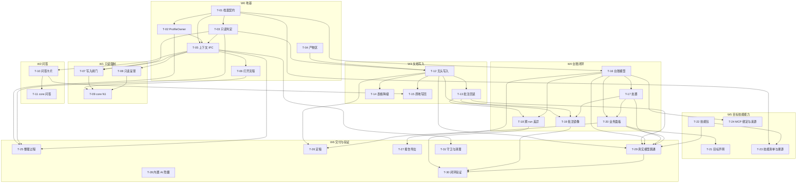

# 业务化工作区 — 任务分解与依赖顺序

状态：**待排期**（2026-10-08）。本文是 [`business-workspace-design.md`](business-workspace-design.md) 的执行版：设计文档说"为什么这样设计"，本文说"具体做什么、先做什么、怎么算做完"。

**使用方式**：每个任务块都可独立派给一个实现者（人或子代理）。派发时把 **依赖 + 涉及文件 + 验收** 三块一起给它；不要在依赖未完成时抢先开工。任务号 `T-01…T-32` 稳定，只增不改。

## 0. 字段约定

| 字段 | 含义                                                       |
| ---- | ---------------------------------------------------------- |
| 依赖 | 必须先完成的任务；空 = 可立即开工                          |
| 涉及 | 预计要改/新增的文件或目录（设计文档已确认的落点）          |
| 步骤 | 要做的具体动作，不是原则                                   |
| 验收 | 走哪条 lane、什么证据等级、看什么现象                      |
| 规模 | S ≤ 0.5 天 / M ≈ 1–2 天 / L ≈ 3–5 天（给排期用，不是承诺） |

**证据等级**（沿用仓库既有分级，不得互相替代）：`unit`（Node 逻辑，进 `pnpm check`）→ `core`（免凭据 Electron，每个 PR 必过）→ `live`（真实 provider）→ `native`（macOS 真实 OS 行为）→ `production`（打包产物）。

**全局完成定义（每个任务都适用）**

1. `pnpm check` 全绿（format:check + lint + check:architecture + typecheck）。
2. 新增可见行为必须配 `core` spec，**并在 `apps/desktop/package.json` 加 `test:core:<name>` 脚本**；新增纯逻辑进 `tests/unit`。
3. 桌面改动必须在真实 Electron 上跑过（单测绿不算数）。UI/状态/持久化改动 = `core`；依赖真实模型 = `live`。
4. 不许用 `.only`、不许重试/skip/加超时来消灭 flake；flake 当 bug 修（`apps/desktop/tests/AGENTS.md`）。
5. 提交前跑图谱变更分析；工具链坏时用 `pnpm dlx gitnexus@1.6.12 detect-changes --scope all --repo .`。
6. 改到 `AGENTS.md` 记录的内容时，同步更新该 `AGENTS.md`。
7. 不扩 guard 白名单；新 owner 接入既有边界（renderer / contract-authority / host-boundary / state-owner / IPC 主帧）。

## 1. 波次索引

| 波次 | 主题                                         | 任务       | 里程碑出口        |
| ---- | -------------------------------------------- | ---------- | ----------------- |
| W0   | 地基：业务档案、分区判定、内部产物区、上下文 | T-01…T-06  | —                 |
| W1   | 只读强制与呈现                               | T-07…T-09  | **N1**（M1 落地） |
| W2   | 结构化问答（form 载体）                      | T-10, T-11 | 支撑 N3/N4        |
| W3   | 文档写入能力（无头路径 + 批注回读）          | T-12…T-15  | 支撑 N3           |
| W4   | 台账与采纳/驳回闭环                          | T-16…T-20  | 支撑 N4           |
| W5   | 目标、技能包、能力绑定                       | T-21…T-24  | **N2**（M2 落地） |
| W6   | 整理过程、交付、端到端验证、收尾             | T-25…T-32  | **N3 / N4 / N5**  |

### 依赖总览（只画跨波次边；波次内依赖见表下方的图注）

**关键路径**：T-01 → T-02 → T-05 → T-12 → T-13 → T-16 → T-17 → T-19 → T-29 → T-30。

**可并行组**（互不阻塞，可同时派发）：

- `{T-02, T-03, T-04}`（都在 T-01 之后）
- `W2` 与 `W3` 整体可并行（T-12 只依赖 T-03）
- `{T-16, T-22, T-28}` 可与 `W1/W2` 并行
- `{T-27, T-31, T-32}` 游离任务，随时插入

## 2. W0 — 地基

### T-01 业务档案契约与校验器

- **依赖**：无
- **涉及**：新增 `apps/desktop/contracts/business-workspace.ts`；单测 `apps/desktop/tests/unit/business-workspace.spec.ts`
- **步骤**：定义 `WorkspaceProfile` 类型（`schemaVersion / business / name? / goal? / zones? / skills? / capabilities? / delivery?`，字段见设计文档 §5.2）；写校验函数：版本不支持→拒绝、字段类型错→拒绝、未知字段→拒绝（与既有外部数据校验惯例一致，不静默丢弃）；缺失可选字段→补默认值；导出默认交付规则（`commentTarget: "copy"`）。
- **验收**：`unit` lane 覆盖合法 / 版本过高 / 类型错 / 未知字段 / 全缺省（平铺）五种输入；`pnpm check` 绿。
- **规模**：S

### T-02 WorkspaceProfileOwner

- **依赖**：T-01
- **涉及**：新增 `apps/desktop/electron/workspace/workspace-profile.ts`；接入 `apps/desktop/electron/application/app-store.ts` 的组合点
- **步骤**：读 `<workspace>/.bid/workspace.json`（缺失/损坏返回可区分的状态，不抛断）；写用原子写（tmp + rename，沿用既有写入纪律），软件生成的档案保留上一版 `.bak`；**不把 workspaceId / 时间戳 / 最近状态写进档案**；推导工作区上下文（业务类型、分区映射、技能清单、MCP 引用、交付规则）；支持"重建/初始化档案"。
- **验收**：`unit` lane 覆盖读三态、原子写、`.bak` 保留、损坏时原字节不被覆盖；owner 不得直接访问 `store.state`（state-owner 守卫必须仍然通过）。
- **规模**：M

### T-03 分区只读判定与写入闸门（纯逻辑）

- **依赖**：T-01
- **涉及**：新增 `apps/desktop/contracts/workspace-zones.ts`（路径判定纯函数）+ unit spec
- **步骤**：把 `zones` 映射解析成 `relative path → zone kind` 查找（处理嵌套、大小写、路径分隔符、`..` 越界）；实现 `zoneOf(relPath)` / `isReadOnlyPath(relPath)` / `assertWritable(relPath)` 语义（参考 `vendor/genoffice/workspace-harness/src/workspace/zones.ts:42-88`，**只借鉴语义不引入代码**）；**零分区时全部视为可写**，但返回"未分区"标记供上层决定提示。
- **验收**：`unit` lane 覆盖：只读区拒写、可写区放行、未声明区放行、越界路径拒绝、多目录映射到同一 kind、同名嵌套优先级。
- **规模**：S

### T-04 内部产物区 ArtifactStoreOwner

- **依赖**：无
- **涉及**：新增 `apps/desktop/electron/artifacts/artifact-store.ts` + 契约
- **步骤**：路径派生 `<userData>/artifacts/<workspaceKey>/<sessionId>/<runId>/…`，`workspaceKey = sha256(realpath)` 前 16 位十六进制 + 一份 `workspaces.json` 映射表用于反查；提供"写产物 / 读指定 run 的指定产物 / 清理"窄接口；保留策略给具体数字（建议每工作区最近 N 个 run、总量上限 M MiB，最旧先删）；**不暴露渲染层列目录能力**；给一个排障用的"查看本 run 内部产物"入口。
- **验收**：`unit` lane 覆盖路径派生稳定性（同一工作区不同调用得到同一 key）、清理策略边界（不删可见产物、不删未完成 run）、两个工作区互不可见。
- **规模**：M

### T-05 工作区上下文 IPC 与 renderer 契约

- **依赖**：T-01, T-02, T-03
- **涉及**：`apps/desktop/contracts/ipc.ts`、`apps/desktop/electron/ipc/register-desktop-ipc.ts`、`apps/desktop/electron/preload.ts`、`apps/desktop/contracts/desktop-state.ts`
- **步骤**：新增"取工作区上下文 / 更新档案"两个窄请求；走既有 `mainFrameHandler`（不得裸用 `ipcMain`，IPC 主帧守卫会失败）；上下文只经窗口 owner 投影给发起窗口，不做全局广播；renderer 侧只加类型与取值，不自己推导。
- **验收**：`unit`/guard 通过；`core` spec 里能断言"打开带档案的工作区 → 面板显示业务类型"；多窗口下不互相重置。
- **规模**：M

### T-06 打开目录的识别与兜底流程

- **依赖**：T-05
- **涉及**：`apps/desktop/src/features/threads/sidebar.tsx`、`apps/desktop/src/app/*`（业务上下文条占位）、`apps/desktop/tests/core/open-folder.spec.ts` 邻近新增 spec
- **步骤**：打开目录后按档案三态分流：合法→应用上下文；损坏→标记"业务档案无效"+ 修复/重建入口 + 诊断，**不阻断打开**；缺失→探测目录（是否有待审 `.docx`、是否有 `评审条件.md` 类判据文件）+ 询问"是否按推荐规格初始化"（先可用最小内置确认面，T-10 完成后切换为问答卡片）；用户拒绝 → 按普通工作区打开。
- **验收**：`core` spec 覆盖三态 + 拒绝初始化路径；真实 Electron 上肉眼确认三种提示。
- **规模**：M

## 3. W1 — 只读强制与呈现（里程碑 N1）

### T-07 主进程写入路径的只读强制

- **依赖**：T-03, T-05
- **涉及**：`apps/desktop/electron/platform/files/app-store-files.ts` 及所有 renderer 可触发的写入路径（文件写、文档写、后续 T-12 的写入）
- **步骤**：在写入前统一查工作区上下文 + `assertWritable`；只读分区拒绝并给出可读原因（不是 UI 禁用而已）；越界/未声明区按 T-03 规则放行。
- **验收**：`core` spec **必须包含绕过 UI 的 IPC 直调路径**（直接调写文件请求写只读区 → 被拒）；这条是 N1 的关键证据。
- **规模**：M

### T-08 只读分区的呈现

- **依赖**：T-05
- **涉及**：`apps/desktop/src/features/workbench/file-workbench-state.ts`、`apps/desktop/src/features/workbench/file-editor-pane.tsx`、业务上下文条
- **步骤**：Files 里只读分区的文件显示只读标记；文档视图对只读区文档以只读打开（沿用 `document-view.ts` 的可见性/只读参数）；上下文条给出分区概览（只读/可写）并可点击定位。
- **验收**：`core` spec 断言只读标记与可写区不显示；真实 Electron 截图确认。
- **规模**：S

### T-09 core spec：档案三态 + 只读拒绝（N1 出口）

- **依赖**：T-06, T-07, T-08
- **涉及**：新增 `apps/desktop/tests/core/workspace-profile.spec.ts` + `apps/desktop/package.json` 的 `test:core:workspace-profile`
- **步骤**：用 `tests/helpers/electron-app.ts` 的 `makeUserDataDir / makeWorkspace` 造三种工作区；断言上下文取值、只读拒绝（含 IPC 直调）、标记呈现、损坏档案不阻断打开。
- **验收**：新脚本单跑绿 + `test:e2e:core` 不回归；**里程碑 N1 达成**（= 设计文档 M1 落地）。
- **规模**：M

## 4. W2 — 结构化问答（form 的载体）

### T-10 问答卡片通道

- **依赖**：T-05
- **涉及**：新增 `apps/desktop/electron/conversation/ask.ts` + 契约（`apps/desktop/contracts/` 新文件）+ renderer 卡片组件 + 扩展侧可调用入口
- **步骤**：卡片形态 = 单选 / 多选 / 是·否·确认 / 自由文本（可选默认值与"跳过"）；载体复用 transcript 卡片位置（`pi-gui.card` 的 `appendEntry` 机制）；答案经窄 IPC 回收，**既进模型上下文（作为工具结果）也进台账**（问题可与条目关联）；生命周期：会话切换 / 窗口关闭 / 运行时换代 → 卡片失效并给原因，**未知结果绝不自动重放**；超时 → 显式"用户未答"，不做默认选择。
- **验收**：`unit` 覆盖状态机与失效；`core` spec（T-11）覆盖真实点击回收。
- **规模**：L

### T-11 core spec：问答卡片语义

- **依赖**：T-10
- **涉及**：新增 `apps/desktop/tests/core/ask-card.spec.ts` + `package.json` 脚本
- **步骤**：断言四种形态的答案回收、切换会话后旧卡片不可答、关窗后不悬挂、超时结果显式。
- **验收**：新脚本绿；不得用重试掩盖竞态（等待"真实状态"，例如面板上的 `data-state`）。
- **规模**：M

## 5. W3 — 文档写入能力

### T-12 无头 docx 写入封装 + 工作副本

- **依赖**：T-03, T-04
- **涉及**：`extensions/bid-review/parser-docx.mjs`（演进为可复用的写入适配层）、`extensions/bid-review/document.ts`、新增无头写入能力（是否抽到独立包见"未决"）
- **步骤**：封装"读原稿 → 构造 `SaveBlock[]` → `saveDocx` → 写工作副本"；工作副本命名 `<原名>-批注.docx` 且**默认落 `output` 分区**；写前查只读、记录源文件内容指纹；写入结果必须报告 `skipped` 明细；错误分类（不可解析 / 无权限 / 只读 / 引擎失败）。
- **验收**：`core` spec 用真实样例 docx 跑通写出并**重新解析回读**（断言批注存在、正文块数不变）；`extensions/bid-review` 的 `node build.mjs --check` 通过（签入 bundle 必须与源码一致）。
- **规模**：M

### T-13 批注读取接进链路

- **依赖**：T-12
- **涉及**：`extensions/bid-review/document.ts`（`BidParsedDocument` 补 comments）、`contract.ts`
- **步骤**：把 `ParsedDoc.comments`（`id / author / date / text / parentId / done / paraId`）解析进业务模型；按 `paraId` / 文本匹配回映到块；供"上一轮提了什么"使用。
- **验收**：`core` spec：对含批注的 docx 读回批注数、作者、`done` 状态与锚定块；样例可先用 T-12 产出的工作副本。
- **规模**：S

### T-14 表格内位置的降级与显式报告

- **依赖**：T-12
- **涉及**：`extensions/bid-review/parser-docx.mjs`（`runRange` / `REGENERABLE` 路径）
- **步骤**：目标块落在表格内时，改为锚定该表格所在/表标题段落，批注正文写明行列（如"报价明细表 第3行 合计"）；结果里**显式报告"未锚定到单元格"**，不做静默降级；把这条限制写进面向用户的说明。
- **验收**：`core` spec 用样例报价表断言：批注出现在表标题段落 + 结果含未锚定报告；用户可见文案不含"已精确锚定"之类误导表述。
- **规模**：M

### T-15 原地写回（**受 R3 决策门控**）

- **依赖**：T-12, T-10
- **涉及**：T-12 的写入层 + 备份逻辑
- **步骤**：仅在用户显式选择时启用；写前自动备份 `<原名>.bak-<时间戳>.docx`；写前二次确认（问答卡片）；写前校验源文件指纹未变，变了就中止并报告。
- **验收**：`core` spec 覆盖备份生成 + 指纹冲突中止 + 只读区拒绝；**开工前必须先由用户确认 R3（编辑器保存/原地写是否在本轮范围内）**。
- **规模**：M

## 6. W4 — 台账与采纳/驳回闭环

### T-16 台账模型与记账工具

- **依赖**：T-01（契约风格）
- **涉及**：`extensions/bid-review/contract.ts`（`Finding` / `Ledger` / `ReviewRunHeader`）、`review.ts`、`index.ts`（新工具 `bid_record_findings` 或演进既有 `bid_record_findings`）
- **步骤**：字段沿用设计文档 §7.4（`severity / check / basis / location / quote / verdict / problem / advice / disposition / fingerprint`）；**借鉴但重写** `vendor/genoffice/workspace-harness/src/tools/review.ts:26-53,107-134` 的枚举与校验思路（非"满足"必填 `problem`、id 不重复、枚举合法、必填非空）；run 头记录文档指纹、技能与判据版本、模型、时间；台账落会话 state（Pi session entries 是持久所有者）+ 可选导出 `feedback/` 分区。
- **验收**：`unit` 覆盖校验拒绝用例；`core` spec 断言面板能显示 run 头与条目。
- **规模**：M

### T-17 处置工具与状态机

- **依赖**：T-16
- **涉及**：`extensions/bid-review/index.ts`（新工具）、`contract.ts`
- **步骤**：`待定 / 采纳 / 驳回` 状态机 + `disposedBy / disposedAt / dispositionNote` 审计字段；**驳回也记账**（"为什么被驳回"是判据改进的输入）；记录 run 内处置进度。
- **验收**：`unit` 覆盖非法迁移与审计字段；`core` spec 覆盖逐条处置后进度更新。
- **规模**：M

### T-18 跨 run 差异

- **依赖**：T-13, T-16
- **涉及**：`extensions/bid-review/review.ts`（fingerprint 与差异计算）
- **步骤**：`fingerprint = check + location + quote 的稳定摘要`；新一轮 run 与上一轮比对，产出四类：**新增 / 仍存在 / 未再出现 / 已处置后仍存在**；差异只作为呈现与判断输入，**不自动改处置**。
- **验收**：`unit` 覆盖四类分类与 fingerprint 稳定性（同一问题文字微调是否算同一条要有明确规则并测试）。
- **规模**：M

### T-19 批注镜像（处置 ↔ 批注）

- **依赖**：T-12, T-13, T-17
- **涉及**：写入层 + 处置工具
- **步骤**：应用内处置 → 写回批注的 `done` 标记 + 追加一条回复（如"已采纳"）；**权威在台账**，本轮不做 Word→应用的自动反向同步；提供显式"从批注重新同步"动作（人工触发）。
- **验收**：`core` spec：处置后重读工作副本，断言 `done` 与回复出现；显式同步动作可用。
- **规模**：M

### T-20 业务面板演进（条目清单 + 处置 + 进度）

- **依赖**：T-16, T-17
- **涉及**：`extensions/bid-review/desktop.ts`、`document-desktop.ts`
- **步骤**：面板显示 run 头、按严重度分组条目、逐条处置（采纳/驳回/待定 + 备注）、处置进度、未锚定报告、"定稿"入口占位；文档视图的批注卡与条目 id 对得上；空态/错误态/加载态明确。
- **验收**：`core` spec（扩 `bid-review.spec.ts` 或新增）覆盖渲染与处置交互；`node extensions/bid-review/build.mjs --check` 通过。
- **规模**：L

## 7. W5 — 目标、技能与能力绑定

### T-21 目标声明

- **依赖**：T-20
- **涉及**：`extensions/bid-review/index.ts`（会话内声明）、业务上下文条、`apps/desktop/src/features/conversation/*`
- **步骤**：目标 = 自然语言 + 结构化部分（审哪个文件、哪些判据、交付形式）；在业务上下文条恒常可见且可编辑；进模型上下文；同一会话内的追问与"再补一轮审查"天然作为迭代。
- **验收**：`core` spec 断言目标显示与编辑后持久（重启/切换会话后仍在）；`live` 由 T-29 覆盖。
- **规模**：M

### T-22 首批业务技能包（判据 SOP）

- **依赖**：无（可与代码并行）
- **涉及**：业务包模板（建议 `extensions/bid-review/skills/` 或仓库内模板目录）+ 落地到 `<工作区>/.agents/skills/<name>/SKILL.md`
- **步骤**：按四类判据各写一个技能（资质 / 报价一致性 / 技术方案 / 格式合规），每个含：判据条目、怎么核对、边界与反例、输出要求；**与 `评审条件.md` 分工不重复**（判据文件说"要求什么"，技能说"怎么查"）；技能里显式引用判据文件的指纹/版本（R8）。
- **验收**：把技能放进一个工作区后，Settings → "Skills and extensions" 显示 scope 为 Workspace，`/skill:<name>` 可用（`core` spec 参照 `skills-settings.spec.ts` 的构造方式）。
- **规模**：L

### T-23 技能清单启用与 run 溯源

- **依赖**：T-01, T-22
- **涉及**：档案 `skills` 字段 → 技能启停（既有 `setSkillEnabled` 路径）+ run 头记录 `skillId / skillVersion`
- **步骤**：档案里的技能清单驱动启停；找不到的技能显式报错（不静默忽略）；run 头记录所用技能与其内容指纹。
- **验收**：`core` spec 覆盖"清单含不存在的技能 → 显式提示"；run 头可回答"这次用了哪些技能/判据/版本"。
- **规模**：M

### T-24 MCP 绑定与依据来源入账

- **依赖**：T-16
- **涉及**：档案 `capabilities.mcp` ↔ `.pi/mcp.json`（既有 `mcp-config.ts`）、Settings → MCP servers、台账字段
- **步骤**：档案只做引用与展示，**不重复存凭据**；档案引用了不存在的 server → 显式提示（不静默）；台账条目增加"依据来源"（MCP 来源与时间），保证结论可复核（R6）。
- **验收**：`core` spec 覆盖引用存在/不存在两种；条目里来源字段可见。
- **规模**：M

## 8. W6 — 整理、交付、验证与收尾

### T-25 整理过程（可跳过）

- **依赖**：T-02, T-03, T-05
- **涉及**：业务扩展新工具 + 面板；`apps/desktop/src/features/threads/sidebar.tsx` 邻近入口
- **步骤**：动作集合 = 扫描与分类**建议**（不自动移动）/ 移动到分区 / 挂引用 / 复制入区 / 生成判据骨架 / 生成业务档案 / 初始化 git 版本（无 git 静默降级）；每个动作幂等、可预览、产出清单，冲突显式报告；**只归位不改内容**；跳过路径必须成立（仅靠分区声明 + 判据文件就能跑完审查）。
- **验收**：`core` spec 覆盖一次完整整理 + 一次冲突报告 + 跳过整理直接审查；**"挂引用"用 symlink 还是拷贝需先定 R5**。
- **规模**：L

### T-26 定稿动作

- **依赖**：T-12, T-20
- **涉及**：业务面板 + 写入层
- **步骤**：基于工作副本另存 `<名>-定稿<日期>.docx`（或用户指定），**原稿与工作副本都保留**；正文自动改写**不在本轮**（明确告知用户"定稿含批注与处置记录"）。
- **验收**：`core` spec 断言定稿生成后原稿字节未变、工作副本仍在；文案不暗示正文已被改写。
- **规模**：M

### T-27 报告导出（替换桩）

- **依赖**：T-16
- **涉及**：`extensions/bid-review/index.ts`（`bid_export_report` 目前是桩，只返回 `/tmp` 路径）
- **步骤**：导出条目清单（Markdown 为主，HTML 次之）到 `feedback/` 分区；含 run 头、按严重度分组、处置状态；**要么实现，要么删掉这个工具**，不留假路径。
- **验收**：`core` spec 断言文件真实落盘且内容含条目与 run 头。
- **规模**：S

### T-28 内置 AI 面板默认隐藏

- **依赖**：无
- **涉及**：`apps/desktop/electron/document-preload.ts`（`aiStream`/`aiStreamCancel`/`reportViewMenuState` 现状为 noop）、`packages/document-editor`（若走"精简模式"）
- **步骤**：文档视图初始化给 `showBuiltinAi: false` 默认值（先按 (a) 在 preload 阶段写入编辑器偏好 `aidocs.showAi=0`）；`reportViewMenuState` 从 noop 接成真实通道；Settings → 文档视图加"显示内置 AI 面板"开关（默认关）。**这是呈现层隐藏，不是安全边界**，文档里不得写成隔离。
- **验收**：`core` spec（扩 `document-view.spec.ts`）：默认不可见、开关打开后可见；文案准确。
- **规模**：M

### T-29 真实模型端到端跑通（N3 出口）

- **依赖**：T-12, T-13, T-16, T-17, T-20, T-22
- **涉及**：`apps/desktop/tests/live/`（新增审查流程 spec）+ 运行配方
- **步骤**：真实 provider 下完成一次完整审查：读 docx → 装载判据技能 → 出条目 → 写工作副本批注 → 面板可见；保留 trace 与产物 docx，并在 Word 里人工确认批注可见。
- **验收**：`live` lane 真实跑通（`PI_APP_REAL_AUTH=1` + `PI_APP_REAL_AUTH_SOURCE_DIR=...`，全 skipped 不算证据）；证据等级 = real-provider conversation。**这是设计文档里"从未用真实模型跑通过一次"的关闭条件**。
- **规模**：L

### T-30 闭环端到端验证（N4 / N5 出口）

- **依赖**：T-18, T-19, T-29
- **涉及**：`core` + `live` 各一段
- **步骤**：审核 → 逐条处置 → 再审一轮 → 看差异分类与批注镜像；再走定稿与报告导出、确认内置 AI 面板默认不可见。
- **验收**：`core` spec 覆盖处置→再审差异；`live` 覆盖真实模型下的完整闭环；**里程碑 N4/N5 达成**。
- **规模**：M

### T-31 守卫、边界与依赖清理

- **依赖**：T-05
- **涉及**：`scripts/state-owner-boundary.test.mjs` 等守卫、`extensions/bid-review/package.json`
- **步骤**：新 owner 接入 state-owner/contract-authority/host-boundary/IPC 主帧守卫的 rejected fixture（**不扩白名单**）；核对新契约的权威来源；**决策 `extensions/bid-review/package.json` 里 `@genoffice/workspace-harness` 这个已声明但零引用的依赖**——要么引入（须先解决 SDK 版本冲突，见设计文档 §4.4），要么删除。
- **验收**：`pnpm test:guards` + `pnpm check:architecture` 绿；依赖清理有明确结论。
- **规模**：M

### T-32 文档订正

- **依赖**：无（随时）
- **涉及**：`README.md`、`AGENTS.md`、`docs/plan.md`、`docs/status-report.md`
- **步骤**：订正三处既有不实/过时描述：README/AGENTS 声称的根级 `skills/` 目录与 docs 引用的 `.agents/skills/verify-pi-gui/` 实际不存在；`plan.md` 状态表说"Word 批注输出未做"（已实现）与"docx-engine 零引用"（已引用）；`workspaces/*/.pi/settings.json` 的扩展路径指向另一个 checkout。
- **验收**：文档描述与当前 checkout 一致；不动代码。
- **规模**：S

## 9. 未决项对本批次的门控

| 未决                                   | 门控哪些任务                | 说明                                                                    |
| -------------------------------------- | --------------------------- | ----------------------------------------------------------------------- |
| **R3** 编辑器保存/原地写是否在本轮范围 | **T-15** 开工前必须确认     | 不确认就只能做"出新文件"路线（T-12/T-26 已覆盖）                        |
| **R5** 引用用 symlink 还是拷贝         | T-25 的"挂引用"动作         | 建议默认拷贝进 `material`，仅在用户显式选择时 symlink，并在 UI 标明来源 |
| **R1** 表格内锚定（引擎改动）          | 不阻塞本批；T-14 是短期降级 | 引擎改动是独立设计 + 独立验证                                           |
| 无头写入能力放哪                       | T-12 的实现位置             | 先在 `extensions/bid-review` 内演进；若第二个业务包也要用，再抽包       |

**明确不在本批（避免被误排进来）**：编辑器原地保存接上（G1 的完整解法）、表格内 run 锚定的引擎改动（R1 长期方案）、Word→应用的处置反向自动同步（R4）、定稿时的正文自动改写、业务角色与权限（设计文档非目标）。

## 10. 与设计文档的映射

| 设计文档                                           | 本批次任务                                                                                                                                 |
| -------------------------------------------------- | ------------------------------------------------------------------------------------------------------------------------------------------ |
| §5 工作区模型（档案 / 分区 / 打开流程 / 只读强制） | T-01…T-03, T-05…T-09                                                                                                                       |
| §6 资源组织                                        | T-25                                                                                                                                       |
| §7.1 目标与 Run                                    | T-21                                                                                                                                       |
| §7.2 技能（SOP 与判据）                            | T-22, T-23                                                                                                                                 |
| §7.3 能力绑定（MCP）                               | T-24                                                                                                                                       |
| §7.4 条目与台账                                    | T-16, T-18                                                                                                                                 |
| §7.5 批注写回                                      | T-12, T-13, T-14, T-15                                                                                                                     |
| §7.6 采纳/驳回闭环                                 | T-17, T-19                                                                                                                                 |
| §7.7 定稿与交付                                    | T-26, T-27                                                                                                                                 |
| §8 内部产物                                        | T-04                                                                                                                                       |
| §9.1 工作区上下文                                  | T-06, T-08, T-20                                                                                                                           |
| §9.2 问答卡片                                      | T-10, T-11                                                                                                                                 |
| §9.3 form / HTML 承载                              | T-11, T-27                                                                                                                                 |
| §9.4 genspark 隐藏                                 | T-28                                                                                                                                       |
| §10 改动清单 A1–A14                                | A1→T-01/02；A2→T-05；A3→T-04；A4→T-10；A5→T-07；A6→T-12/15；A7→T-13；A8→T-16/17；A9→T-14；A10→T-20；A11→T-27；A12→T-28；A13→T-22；A14→T-25 |
| §11 分期 N1–N5                                     | N1→T-09；N2→T-22/23/24；N3→T-29；N4→T-30；N5→T-26/27/28                                                                                    |
| 缺口 G1–G7                                         | G1→T-15（部分）；G2→T-14；G3→T-13；G4→T-17/T-19；G5→T-10；G6→T-04；G7→T-02/T-06                                                            |
